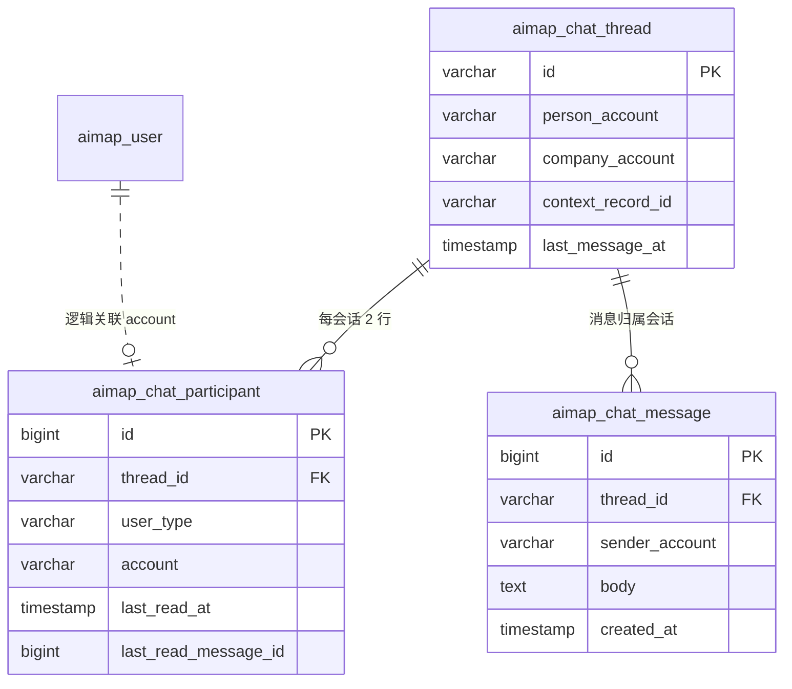

# 消息中心 — 数据库设计

**版本**：V7（`db/migration/V7__chat_messages.sql`）  
**原则**：每个用户只看到自己的收件箱行；会话与消息按「个人 + 企业 + 业务场景」隔离，**不做全局公用聊天室**。

---

## 一、设计目标

| 目标 | 说明 |
|------|------|
| **用户隔离** | 用户 A 无法列出或读取用户 B 的会话；所有查询带 `(user_type, account)` |
| **双边专用** | 仅 **PERSON ↔ COMPANY** 一对一沟通，绑定一个 `context_record_id`（岗位/人才匹配场景） |
| **可持久化** | 替换前端 `localStorage`（`aimap.chat`），换设备/清缓存不丢记录 |
| **与现网一致** | 会话 id 规则与前端 `chat.ts` 的 `threadIdFor` 对齐 |

---

## 二、逻辑模型（ER）



**为何不「公用一张消息大表」？**

- 列表接口：`SELECT ... FROM aimap_chat_participant WHERE user_type=? AND account=?`，**只扫当前用户行**。
- 消息接口：先校验 `participant` 存在，再 `WHERE thread_id=?`，禁止按 `sender_account` 全表扫他人消息。
- 同一会话固定两行 participant（个人一行、企业一行），互不混用。

---

## 三、表结构说明

### 1. `aimap_chat_thread`（会话元数据）

一场景一条：同一对个人 + 同一 `context_record_id` 唯一。

| 字段 | 类型 | 说明 |
|------|------|------|
| `id` | VARCHAR(96) PK | `chat:{person}::{company}::{context}`（账号小写，与前端一致） |
| `person_user_type` / `person_account` | | 个人侧，默认 `PERSON` |
| `company_user_type` / `company_account` | | 企业侧，默认 `COMPANY` |
| `context_record_id` | VARCHAR(64) | 如 `job-001`、`tp-xxx` |
| `context_title` / `context_org` | | 展示用（岗位名、机构） |
| `last_message_at` | TIMESTAMP | 会话排序 |

**唯一约束**：`(person_*, company_*, context_record_id)` — 防止重复开聊。

### 2. `aimap_chat_participant`（用户收件箱 · 隔离核心）

| 字段 | 类型 | 说明 |
|------|------|------|
| `thread_id` | | 所属会话 |
| `user_type` + `account` | | **当前用户身份**（与 `aimap_user` 一致） |
| `display_name` | | 发消息时展示名快照 |
| `last_read_at` | | 已读水位 |
| `last_read_message_id` | BIGINT | 已读到的最大 `aimap_chat_message.id` |

**唯一约束**：`(thread_id, user_type, account)` — 每用户在同一会话仅一行。

**未读数（查询时计算）**：

```sql
SELECT COUNT(*) FROM aimap_chat_message m
JOIN aimap_chat_participant p ON p.thread_id = m.thread_id
WHERE p.user_type = ? AND p.account = ?
  AND m.thread_id = ?
  AND m.id > IFNULL(p.last_read_message_id, 0)
  AND NOT (m.sender_user_type = p.user_type AND m.sender_account = p.account);
```

### 3. `aimap_chat_message`（消息正文）

| 字段 | 类型 | 说明 |
|------|------|------|
| `thread_id` | | 必须属于已授权会话 |
| `sender_user_type` / `sender_account` | | 发送方 |
| `sender_name` | | 展示名 |
| `body` | TEXT | 正文 |
| `created_at` | | 排序 |

不设「全局消息池」字段；**禁止**无 `thread_id` 的广播查询。

---

## 四、隔离规则（API 必须遵守）

1. **列表会话**  
   `FROM aimap_chat_participant p JOIN aimap_chat_thread t ON t.id = p.thread_id`  
   `WHERE p.user_type = :currentType AND p.account = :currentAccount`

2. **拉取消息**  
   先 `SELECT 1 FROM aimap_chat_participant WHERE thread_id=? AND user_type=? AND account=?`  
   通过后再 `SELECT * FROM aimap_chat_message WHERE thread_id=? ORDER BY id`

3. **发送消息**  
   发送者必须是该 `thread_id` 的 participant；写入 `aimap_chat_message` 后更新 `thread.last_message_at` 与双方 participant.`updated_at`

4. **创建会话**  
   `INSERT thread` + **两条** `participant`（个人 + 企业）；若已存在则只返回已有 `thread_id`

5. **管理员**  
   默认**不**接入聊天表；若需审计另做只读报表，不走用户收件箱接口

---

## 五、会话 ID 生成（与前端对齐）

```text
chat:{personAccount}::{companyAccount}::{contextRecordId}
```

- 三段均 `trim()` 后转小写  
- 示例：`chat:demo::galaxy-hr::job-001`

---

## 六、建议 REST API（待实现）

| 方法 | 路径 | 说明 |
|------|------|------|
| GET | `/api/v1/chat/threads` | 当前用户收件箱（分页，按 `last_message_at` 降序） |
| POST | `/api/v1/chat/threads` | 创建/确保会话（body: 对方账号、context、标题等） |
| GET | `/api/v1/chat/threads/{threadId}/messages` | 分页消息（须 participant） |
| POST | `/api/v1/chat/threads/{threadId}/messages` | 发送 |
| POST | `/api/v1/chat/threads/{threadId}/read` | 标记已读（更新 `last_read_message_id`） |

鉴权：沿用 `Authorization: Bearer`，从 token 解析 `userType` + `account`。

---

## 七、与旧 localStorage 的关系

| 项目 | 旧实现 | 新实现 |
|------|--------|--------|
| 存储 | `localStorage` `aimap.chat` | 上表三库 |
| 跨设备 | 否 | 是 |
| 换账号 | 仅前端过滤 | 数据库按 participant 隔离 |
| 迁移 | — | 可选一次性导入脚本（按用户浏览器导出 JSON） |

---

## 八、部署

```bash
# 启动后端时 Flyway 自动执行 V7
cd backend && .\start-backend.ps1
```

验证：

```sql
SHOW TABLES LIKE 'aimap_chat%';
DESC aimap_chat_participant;
```

---

## 九、后续实现清单（代码层）

- [x] JPA Entity + Repository（`ChatThreadEntity`、`ChatParticipantEntity`、`ChatMessageEntity`）
- [x] `ChatController` + `ChatService`（含 participant 校验）
- [x] 前端 `chat.ts` 改为调用 REST（`frontend/src/api/chat.ts`）
- [x] 匹配详情页「发消息」走 `POST /chat/threads` 确保会话存在
