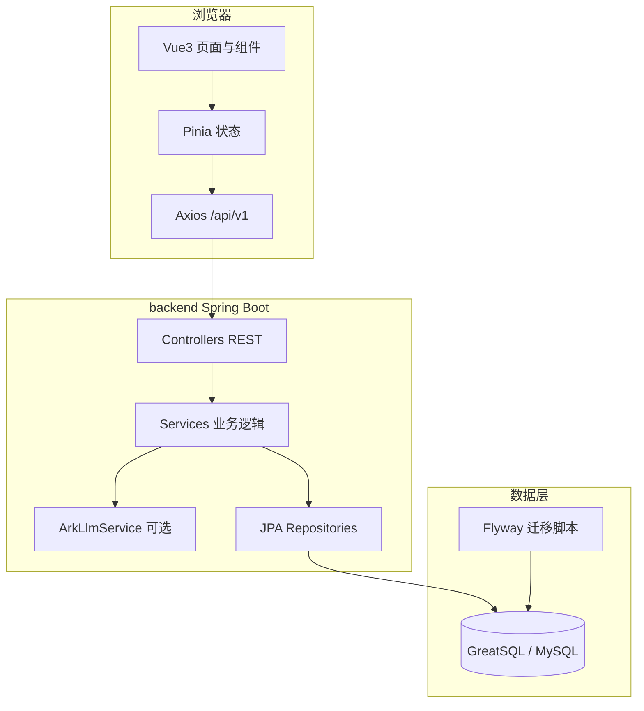

# 软件功能说明与系统结构（2026年5月11日版本）

**文档用途**：帮助快速建立对「本软件做什么、代码怎么分层、数据怎么走」的整体认识。  
**对应仓库**：`frontend/`（Web）、`backend/`（API 与数据）、`docs/`（设计与产品说明）。

---

## 一、产品定位（一句话）

面向**数字化招聘演示**：个人上传**简历**、企业上传**岗位说明（JD）**，系统给出**解析进度与结果展示**、**能力图谱可视化**、基于**霍兰德 RIASEC** 的**职位/候选人推荐**及**匹配详情**；管理员端提供**运营类页面骨架**。可选接入**火山引擎 Ark 大模型**做文本分析与霍兰德估计。

---

## 二、功能说明（按角色）

### 1. 公共能力

| 功能 | 说明 |
|------|------|
| **注册 / 登录 / 登出** | 按账号 + 密码 + **用户类型**（个人 / 企业 / 管理员）区分；登录后前端用 `sessionStorage` 保存 token 与用户信息。 |
| **路由与权限** | 个人仅能访问 `/person/*`，企业 `/company/*`，管理员 `/admin/*`；未登录或类型不符会跳转登录或 403。 |

### 2. 个人端（`PERSON`）

| 模块 | 路径（前缀 `/person`） | 功能要点 |
|------|-------------------------|----------|
| 工作台 | `/person/dashboard` | 入口与导航。 |
| 文档中心 | `/person/doc/list` | 文档列表（与本地/接口数据结合）。 |
| 简历上传 | `/person/doc/upload` | 支持 **PDF / DOC / DOCX**；上传后获得 `docId`。 |
| 解析任务 | `/person/doc/task/:docId` | 轮询后端解析状态（模拟 **PENDING → PROCESSING → DONE** 时间线）。 |
| 解析结果 | `/person/doc/result/:docId` | 结构化字段（技能、教育、项目等）+ **AI 分析与霍兰德**页签（依赖后端 LLM 与 JSON 解析）。 |
| 能力图谱 | `/person/graph/:subjectId` | 基于后端图谱数据，**G6** 可视化（示例数据为主）。 |
| 职位推荐 | `/person/match/jobs` | 调用推荐接口；支持**最低匹配度**筛选；收藏与历史为**浏览器本地**持久化。 |
| 匹配详情 | `/person/match/detail/:recordId` | 分数拆解、霍兰德雷达、技能与证据说明等。 |

### 3. 企业端（`COMPANY`）

与个人端**对称**：JD 上传、解析任务/结果、岗位能力图谱、**候选人推荐**、匹配详情；路由前缀为 `/company`。

### 4. 管理端（`ADMIN`）

| 模块 | 路径（前缀 `/admin`） | 说明 |
|------|------------------------|------|
| 概览、用户、文档库、数据维护、匹配记录、运营监控、日志审计 | `/admin` 下各子路由 | 以**页面与联调骨架**为主，深度数据依赖后端扩展。 |

### 5. 后端 API 能力（与界面一一对应）

- **认证**：`POST /api/v1/auth/register|login|logout`
- **文档**：`POST /api/v1/document/upload`，`GET .../document/{id}/status|result`
- **图谱**：`GET .../graph/person/{id}`、`.../job/{id}`，`POST .../graph/expand`
- **匹配**：`POST .../match/recommend-jobs`、`recommend-candidates`（Body 可选 `{ "minScore": 0~100 }`），`GET .../match/{id}/detail`
- **大模型**：`POST .../llm/extract|explain-match|generate-suggestion`（Ark，未配置 Key 时降级）

更细的接口列表见 **`backend/README.md`**。

---

## 三、系统结构（整体框架）

### 1. 逻辑分层



- **前端**：只通过 **`/api/v1`** 与后端通信（开发时 Vite 代理到 `localhost:8080`）。  
- **后端**：Controller → Service（含匹配、文档、鉴权等）→ JPA → 数据库；文档上传时可调 **Ark** 生成分析 JSON。  
- **数据库**：表结构由 **Flyway** 版本化管理；用户、文档、职位/候选人目录等持久化在 **`aimap_*` 表**。

### 2. 仓库物理结构（你本地应看到的三个块）

```
仓库根目录/
├── docs/                    # 文档（产品说明、架构设计、本文）
├── frontend/                # 前端工程（npm、Vite、Vue）
│   └── src/                 # 页面、路由、API 封装、组件
├── backend/                 # 后端工程（Maven、Spring Boot）
│   ├── src/main/java/       # Controller / Service / Entity / Repo
│   ├── src/main/resources/
│   │   ├── application.yml  # 端口、数据源、JPA、Flyway、Ark
│   │   └── db/migration/    # SQL 版本脚本
│   └── start-backend.ps1    # 打包 + 启动（可加载 .env.backend）
├── database/                # 可选：本机库初始化 SQL
├── scripts/                 # 可选：一键尝试 Docker 库等
├── docker-compose.yml       # 本地 MySQL 8（默认映射 3307）
└── README.md                # 启动入口说明
```

### 3. 一条完整业务链路（帮助「串起来」）

1. 用户打开 **`/auth/login`**，选择类型并登录。  
2. **个人**：`/person/doc/upload` 上传简历 → 得到 `docId` → **`/person/doc/task/:docId`** 轮询状态 → **`/person/doc/result/:docId`** 看结构化结果与 AI/霍兰德。  
3. **`/person/graph/...`** 查看能力图谱（示例图数据）。  
4. **`/person/match/jobs`** 拉推荐列表（后端用**库中职位目录 + 当前用户霍兰德画像**算分；可设最低匹配度）。  
5. 点击某条进入 **`/person/match/detail/:recordId`** 看详情与雷达图。  

企业端把「简历」换成「JD」，「职位推荐」换成「候选人推荐」即可。

### 4. 数据大致流到哪里

| 数据 | 存哪里 |
|------|--------|
| 用户账号、密码、最新简历/岗位霍兰德 JSON | 表 **`aimap_user`**（持久化） |
| 每次上传的文档任务与解析文本、霍兰德 JSON | 表 **`aimap_document`** |
| 系统内置「示例职位 / 示例候选人」及 RIASEC | 表 **`aimap_job_catalog`**、**`aimap_candidate_catalog`**（Flyway 种子数据） |
| 收藏、匹配历史、审计部分记录 | **浏览器本地**（非服务端业务库） |

---

## 四、技术栈速查

| 层级 | 技术 |
|------|------|
| 前端 | Vue 3、Vite、TypeScript、Element Plus、Pinia、Vue Router、AntV G6、ECharts |
| 后端 | Spring Boot 3、Spring Web、Validation、**Spring Data JPA**、**Flyway** |
| 数据库 | **GreatSQL 或 MySQL 8**（JDBC URL 兼容）；本地可用 **Docker**（`docker-compose.yml`） |
| 大模型 | 火山引擎 **Ark**（`ARK_API_KEY` 等，见 `backend/.env.backend`） |

---

## 五、当前边界（避免和功能混淆）

- **文档正文**：当前解析链路仍以**文件名 + 大小**等触发 LLM 为主，**不是**完整 PDF/DOC 版面 OCR 流水线。  
- **管理端**：多为界面与路由就绪，**运营数据深度**依赖后续接口与表设计。  
- **Job-SDF 等外部数据集**：**尚未接入**；若接入宜作为独立「市场洞察」数据源，见产品规划讨论。  
- **信创整机部署**：需在目标银河麒麟环境单独验证浏览器与部署方式，见 **`docs/AI智能匹配与能力图谱系统-前端架构设计方案-V2.0.md`**。

---

## 六、相关文档索引

| 文档 | 内容 |
|------|------|
| `docs/软件产品说明书.md` | 产品概述、角色功能表、接口摘要、演示步骤 |
| `docs/AI智能匹配与能力图谱系统-前端架构设计方案-V2.0.md` | 赛题对标、前端模块与 UI、部署与测试建议 |
| `backend/README.md` | 数据库配置、Ark、启动命令、API 列表 |
| `README.md` | 仓库三目录说明与快速启动 |

---

**文档结束**
