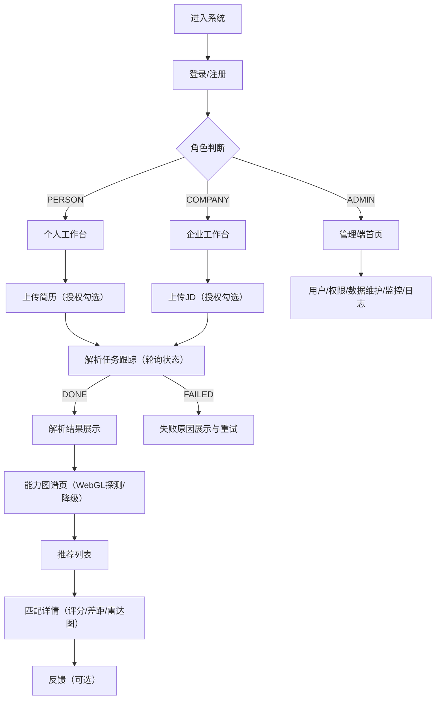

## 1. 产品概述
AI 智能匹配与能力图谱系统是一套面向“个人求职者 / 企业招聘方 / 管理员”的 PC Web 应用，通过“文档解析 → 能力图谱 → 智能匹配”形成闭环，提升人才与岗位匹配效率与可解释性。
- 解决问题：简历/JD 信息结构化困难、匹配缺乏依据、能力差距不透明、管理与监控缺失
- 目标用户：个人用户、企业用户、平台管理员（运营/审计/监控）

## 2. 核心功能

### 2.1 用户角色
| 角色 | 注册/登录方式 | 核心权限 |
|---|---|---|
| 个人用户（PERSON） | 账号注册登录（手机号/邮箱/用户名，按后端实现） | 上传简历、查看解析结果、查看个人能力图谱、获取职位推荐与详情 |
| 企业用户（COMPANY） | 账号注册登录 | 上传 JD、查看解析结果、查看职位能力图谱、获取候选人推荐与详情 |
| 管理员（ADMIN） | 管理员账号登录 | 用户/角色/权限管理、文档/技能库维护、匹配记录查看、运营监控与日志审计 |

### 2.2 功能模块（按页面拆分）
1. **认证**：注册、登录、退出、找回（可选）
2. **文档中心**：简历/JD 上传、授权确认、解析进度跟踪、解析结果展示
3. **能力图谱**：个人/职位图谱可视化、搜索定位、节点详情、展开收起、性能降级
4. **智能匹配**：推荐列表、筛选分页、匹配详情（评分拆解/差距/雷达图/建议）、反馈（可选）
5. **管理端**：用户/角色/权限、文档库、技能库/同义词、匹配记录、监控看板、日志审计
6. **通用体验**：全局错误兜底、空/错/加载态、403/404、兼容模式提示（WebGL 探测）

### 2.3 页面明细
| 页面名称 | 模块名称 | 功能描述 |
|---|---|---|
| 登录/注册页 | 登录 | 表单校验、回车提交、错误提示、角色识别与跳转 |
| 登录/注册页 | 注册 | 个人/企业注册分流、密码强度提示、注册成功引导 |
| 个人工作台 | 概览 | 上传入口、最近解析任务、推荐入口、系统提示 |
| 企业工作台 | 概览 | 上传入口、最近解析任务、推荐入口、系统提示 |
| 文档上传页 | 上传控件 | 支持拖拽、格式/大小校验、进度展示、失败重试 |
| 文档上传页 | 授权确认 | 未勾选授权不可提交，展示合规声明与链接 |
| 解析任务页 | 任务跟踪 | 状态轮询（排队/处理中/完成/失败）、耗时提示、失败原因与重试 |
| 解析结果页 | 结构化展示 | Tab 分区展示字段（技能/经历/教育/项目等），字段缺失兜底 |
| 能力图谱页 | 图谱渲染 | G6 渲染 nodes/edges，拖拽缩放、布局切换、hover 高亮 |
| 能力图谱页 | 搜索定位 | 模糊搜索节点名，定位居中，高亮 1-hop 邻居 |
| 能力图谱页 | 详情抽屉 | 展示节点属性、关联列表、证据（如有） |
| 推荐列表页 | 列表 | Top-N 推荐，筛选/排序/分页，点击进入详情 |
| 匹配详情页 | 评分解释 | 总分与分项拆解、技能覆盖度、缺失技能清单、建议 |
| 匹配详情页 | 可视化 | 雷达图（个人 vs 要求）、条形/进度对比（按接口返回） |
| 管理端-用户管理 | 表格 | 查询/分页/禁用/重置（按权限），批量操作二次确认（可选） |
| 管理端-数据维护 | 技能库/同义词 | CRUD、导入导出（可选）、变更审计入口 |
| 管理端-监控看板 | 概览与趋势 | 服务健康、解析/匹配指标、模型模式状态（占位可用） |
| 管理端-日志审计 | 查询与详情 | 按用户/时间/模块过滤，详情抽屉（默认脱敏） |
| 通用页面 | 403/404/错误页 | 角色越权提示与返回入口，全局异常兜底 |

## 3. 核心流程

### 3.1 主流程说明
- 个人：注册/登录 → 上传简历（授权勾选）→ 进入解析任务页（轮询状态）→ 查看解析结果 → 查看个人能力图谱 → 获取职位推荐 → 查看匹配详情与差距 →（可选）提交反馈
- 企业：注册/登录 → 上传 JD（授权勾选）→ 解析任务 → 解析结果 → 职位能力图谱 → 候选人推荐 → 匹配详情 →（可选）反馈
- 管理员：登录 → 用户/权限管理 → 数据维护（技能库/同义词/文档库）→ 监控与日志审计

### 3.2 流程图（Mermaid）

## 4. 用户界面设计

### 4.1 设计风格
- 设计方向：企业级信息密度 + 强可解释性（评分拆解、证据链、差距项一眼可读）
- 主色：#1677ff（强调/主按钮/链接）
- 功能色：成功 #52c41a，警告 #faad14，危险 #ff4d4f
- 中性色：文本 #262626/#595959/#8c8c8c，背景 #f5f7fa（浅色）或 #0b1220（暗色备选）
- 字体：优先系统默认中文字体栈（信创环境可用性优先），标题加粗增强层级
- 布局：PC 优先，左侧菜单 + 顶部用户信息 + 内容区；详情页采用“双栏信息架构”（左列表右详情或上列表下详情）
- 动效：以“状态反馈”为主（加载骨架、表格行 hover、抽屉/弹窗过渡），避免过度动画影响性能

### 4.2 页面设计总览
| 页面名称 | 模块名称 | UI 要点 |
|---|---|---|
| 登录/注册页 | 表单 | 居中卡片、清晰错误提示、回车提交、角色选择或自动识别 |
| 工作台 | 概览卡片 | 关键入口（上传/图谱/推荐）置顶，最近任务列表可直接跳转 |
| 上传页 | 授权与上传 | 授权复选框与合规声明固定在操作区；上传区支持拖拽与进度条 |
| 任务页 | 状态时间线 | 排队/处理中/完成/失败清晰标签；失败提供重试与问题说明 |
| 图谱页 | 画布与工具条 | 布局切换、搜索、缩放提示；节点详情右侧抽屉；超阈值性能保护提示 |
| 推荐/详情 | 解释性信息 | 总分卡片突出；分项拆解与差距清单结构化；雷达图与条形图对齐同一指标体系 |
| 管理端 | 表格与筛选 | 条件区 + 表格 + 分页；批量操作二次确认；关键字段支持复制 |

### 4.3 响应式
- 默认桌面优先（≥1024px）
- <1024px：菜单可折叠，表格列收敛；图谱页提供“只读简化模式”（禁用复杂交互，避免误触与性能问题）

