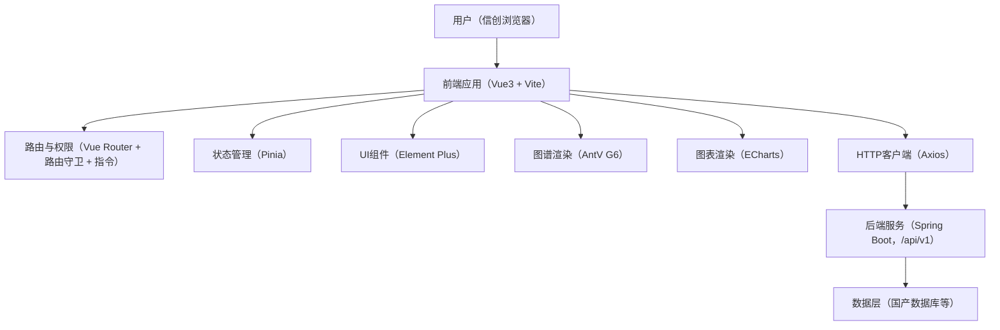

## 1. 架构设计

### 1.1 分层架构（前端视角）


### 1.2 工程结构（建议）
```txt
src/
  assets/
  components/
  layouts/
  views/
    auth/
    person/
    company/
    admin/
  modules/
    auth/
    document/
    graph/
    match/
    admin/
  router/
  stores/
  api/
  types/
  utils/
  hooks/
  main.ts
  App.vue
```

## 2. 技术说明
- 前端：Vue@3.4 + TypeScript@5 + Vite@5
- UI：Element Plus@2.x
- 路由：Vue Router@4.x
- 状态管理：Pinia@2.x
- HTTP：Axios@1.x
- 图谱：@antv/g6@5.x
- 图表：ECharts@5.x
- 构建与部署：`vite build` 产出 `dist/`，Nginx 静态部署 + `/api/` 反向代理

## 3. 路由定义
| 路由 | 用途 | 访问控制（meta） |
|---|---|---|
| /auth/login | 登录 | public |
| /auth/register | 注册 | public |
| /person/dashboard | 个人工作台 | userTypes: PERSON |
| /person/doc/upload | 简历上传 | userTypes: PERSON |
| /person/doc/task/:docId | 解析任务跟踪 | userTypes: PERSON |
| /person/doc/result/:docId | 解析结果 | userTypes: PERSON |
| /person/graph/:personId | 个人能力图谱 | userTypes: PERSON |
| /person/match/jobs | 职位推荐 | userTypes: PERSON |
| /person/match/detail/:recordId | 匹配详情 | userTypes: PERSON |
| /company/dashboard | 企业工作台 | userTypes: COMPANY |
| /company/doc/upload | JD 上传 | userTypes: COMPANY |
| /company/graph/:jobId | 职位能力图谱 | userTypes: COMPANY |
| /company/match/candidates | 候选人推荐 | userTypes: COMPANY |
| /admin | 管理端首页 | userTypes: ADMIN |
| /admin/users | 用户管理 | userTypes: ADMIN |
| /admin/data | 数据维护 | userTypes: ADMIN |
| /admin/monitor | 监控看板 | userTypes: ADMIN |
| /admin/audit | 日志审计 | userTypes: ADMIN |
| /403 | 无权限 | public |
| /:pathMatch(.*)* | 404 | public |

## 4. API 定义（与后端联调契约）

### 4.1 通用约定
- BasePath：`/api/v1`
- 认证：`Authorization: Bearer {token}`
- 响应包装：
```json
{ "code": 200, "message": "success", "data": {} }
```

### 4.2 TypeScript 类型（前端侧）
```ts
export interface ApiResp<T> {
  code: number
  message: string
  data: T
}

export type UserType = 'PERSON' | 'COMPANY' | 'ADMIN'

export interface LoginResp {
  token: string
  userType: UserType
  userId: string
  permissions?: string[]
}

export type DocType = 'RESUME' | 'JOB_DESC'
export type DocStatus = 'UPLOADING' | 'PENDING' | 'PROCESSING' | 'DONE' | 'FAILED'

export interface DocFileVO {
  id: string
  fileName: string
  fileType: 'DOC' | 'PDF'
  docType: DocType
  status: DocStatus
  createdAt: string
}

export interface ParseResultVO {
  docId: string
  status: DocStatus
  resultJson: unknown
  evidences?: Array<{ field: string; page?: number; text?: string }>
}

export interface GraphNode {
  id: string
  label: string
  type: 'Person' | 'Job' | 'Skill' | 'Project' | 'Company' | 'Category'
  props?: Record<string, unknown>
}

export interface GraphEdge {
  id: string
  source: string
  target: string
  type: 'HAS_SKILL' | 'REQUIRES_SKILL' | 'DEPENDS_ON' | 'BELONGS_TO' | 'APPLIED_IN' | 'PUBLISHES'
  props?: Record<string, unknown>
}

export interface GraphData {
  nodes: GraphNode[]
  edges: GraphEdge[]
}

export interface MatchDetailVO {
  recordId: string
  score: number
  scoreBreakdown: Record<string, number>
  matchedSkills: Array<{ name: string; requiredLevel: number; personLevel: number }>
  missingSkills: Array<{ name: string; requiredLevel: number; gap: number }>
  suggestions?: string[]
}
```

### 4.3 接口清单（最小集合）
| 方法 | 路径 | 用途 |
|---|---|---|
| POST | /auth/register | 注册 |
| POST | /auth/login | 登录 |
| POST | /auth/logout | 退出 |
| POST | /document/upload | 上传并触发解析（RESUME/JOB_DESC） |
| GET | /document/{id}/status | 查询解析进度 |
| GET | /document/{id}/result | 获取解析结果 |
| GET | /graph/person/{id} | 个人能力图谱 |
| GET | /graph/job/{id} | 职位能力图谱 |
| POST | /graph/search | 搜索定位（返回 nodeId 或子图） |
| POST | /match/recommend-jobs | 个人推荐职位 |
| POST | /match/recommend-candidates | 企业推荐候选人 |
| GET | /match/{id}/detail | 匹配详情 |
| GET | /match/history | 历史记录 |
| POST | /match/feedback | 反馈（可选） |
| GET | /admin/monitor/summary | 监控聚合（可选/占位） |
| GET | /admin/audit/logs | 审计日志（可选/占位） |

## 5. 关键实现策略

### 5.1 权限与路由守卫
- 登录成功后持久化最小必要信息：token、userType、permissions（可选）
- 路由守卫逻辑：
  - public 路由直接放行
  - 未登录跳转登录并携带 redirect
  - 角色不匹配跳转 /403
  - 细粒度权限用指令或组合式函数控制按钮显示/禁用

### 5.2 文档上传与解析任务跟踪
- 上传前校验：后缀/MIME/大小（50MB）+ 授权勾选必填
- 上传完成后拿到 docId，跳转任务页
- 轮询策略：处理中 1s，排队 3s，长时间未完成 10s（退避），DONE/FAILED 结束

### 5.3 图谱渲染与降级
- 进入图谱页先做 WebGL 探测，失败则提示“兼容模式”，默认切 Canvas/简化布局
- 大图保护：默认只展示 1~2 跳子图；点击节点再增量加载邻居；节点数超阈值提示缩小范围

### 5.4 性能与兼容性
- 构建 target 降级到 `es2018`（可根据目标信创浏览器内核调整）
- 关键依赖分包：g6、echarts、element-plus
- 全局错误兜底：网络错误/超时提示、空/错/加载态一致化

